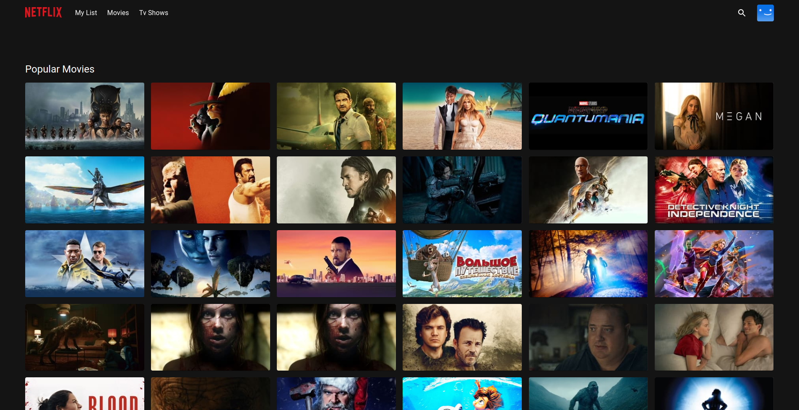

<div align="center">
  <a href="http://netflix-clone-with-tmdb-using-react-mui.vercel.app/">
    
  </a>

  <h3 align="center">Netflix Clone</h3>

  <p align="center">
    <a href="https://netflix-clone-react-typescript.vercel.app/">View Demo</a>
    ·
    <a href="">Report Bug</a>
    ·
    <a href="">Request Feature</a>
  </p>
</div>

<details>
  <summary>Table of Contents</summary>
  <ol>
    <li>
      <a href="#prerequests">Prerequests</a>
    </li>
    <li>
      <a href="#phase-1-initial-setup-and-deployment">Initial Setup and Deployment</a>
    </li>
    <li><a href="#deploy-to-k8s-cluster">Deploy Application</a></li>
    <li>
      <a href="#contact">Contact</a>
    </li>
  </ol>
</details>

<br />

<div align="center">
  
  <p align="center">Architectural Diagram</p>
  
  <p align="center">Home Page</p>
  
  <p align="center">Mini Portal</p>
  
  <p align="center">Detail Modal</p>
  
  <p align="center">Grid Genre Page</p>
  
  <p align="center">Watch Page with customer contol bar</p>
</div>

## Prerequests

- Create an account if you don't have on AWS. 
- Create an account if you don't have on [TMDB](https://www.themoviedb.org/).
  Because I use its free API to consume movie/tv data.
- And then follow the [documentation](https://developers.themoviedb.org/3/getting-started/introduction) to create API Key
- Finally, if you use v3 of TMDB API, create a file named `.env`.
  And then use the API Key you just created.
- Create an account if you don't have on DockerHub, Because It is Open-Source.

## Phase 1: Initial Setup and Deployment
# Step 1: Launch EC2 (Ubuntu 22.04):
- Provision an EC2 instance on AWS with Ubuntu 22.04.
- Connect to the instance using SSH.
# Step 2: Clone the Code:
- Update all the packages and then clone the code.
- Clone your application's code repository onto the EC2 instance:
```sh 
https://github.com/Abhi2729/Netflix_Clone_OPS.git 
```
# Step 3: Install Docker and Run the App Using a Container:
- Set up Docker on the EC2 instance:
``` sh 
sudo apt-get update
sudo apt-get install docker.io -y
sudo usermod -aG docker $USER  # Replace with your system's username, e.g., 'ubuntu'
newgrp docker
sudo chmod 777 /var/run/docker.sock
```

- Build and run your application using Docker containers.
```sh 
docker build --build-arg TMDB_V3_API_KEY=your_api_key_here -t netflix-clone
```
# Phase 2: Security
  # Install SonarQube and Trivy:

  - SonarQube is a static code analysis tool used to assess and analyze code quality. It is typically integrated into a CI/CD pipeline to automatically check code for issues such as bugs, security vulnerabilities, code smells, and maintainability problems. Developers receive feedback on code quality early in the development process, allowing them to address issues before merging code into the main codebase.

  - Trivy is a container image vulnerability scanner. It helps identify security issues in container images. Trivy is integrated into CI/CD pipelines to scan container images for known vulnerabilities and security risks before deployment. By scanning container images, Trivy assists in ensuring that the deployed applications are not running with known vulnerabilities, thus enhancing the overall security posture.

  SonarQube
```sh 
docker run -d --name sonar -p 9000:9000 sonarqube:lts-community
```
To access:

publicIP:9000 (by default username & password is admin)

To install Trivy:
```sh 
sudo apt-get install wget apt-transport-https gnupg lsb-release
wget -qO - https://aquasecurity.github.io/trivy-repo/deb/public.key | sudo apt-key add -
echo deb https://aquasecurity.github.io/trivy-repo/deb $(lsb_release -sc) main | sudo tee -a /etc/apt/sources.list.d/trivy.list
sudo apt-get update
sudo apt-get install trivy        
```
  # Integrate SonarQube and Configure:
  - Integrate SonarQube with your CI/CD pipeline.
  - Configure SonarQube to analyze code for quality and security issues.

# Phase 3: CI/CD Setup:
  # 1. Install Jenkins for Automation:

- Install Jenkins on the EC2 instance to automate deployment: Install Java
- Access Jenkins in a web browser using the public IP of your EC2 instance.

  # 2.Install Necessary Plugins in Jenkins:
  Install below plugins

  1 Eclipse Temurin Installer (Install without restart)

  2 SonarQube Scanner (Install without restart)

  3 NodeJs Plugin (Install Without restart)

  4 OWASP Dependency Check

  5 Docker-

  6 Kubernetes-

## Configure Java and Nodejs in Global Tool Configuration
Goto Manage Jenkins → Tools → Install JDK(17) and NodeJs(16)→ Click on Apply and Save

## SonarQube
Create the token

Goto Jenkins Dashboard → Manage Jenkins → Credentials → Add Secret Text. 
After adding sonar

The Configure System option is used in Jenkins to configure different server

Global Tool Configuration is used to configure different tools that we install using Plugins

# Install Dependency-Check Plugin:

- Go to "Dashboard" in your Jenkins web interface.
- Navigate to "Manage Jenkins" → "Manage Plugins."
- Click on the "Available" tab and search for "OWASP Dependency-Check."
- Check the checkbox for "OWASP Dependency-Check" and click on the "Install without restart" button.

# Configure Dependency-Check Tool:

- After installing the Dependency-Check plugin, you need to configure the tool.
- Go to "Dashboard" → "Manage Jenkins" → "Global Tool Configuration."
- Find the section for "OWASP Dependency-Check."
- Add the tool's name, e.g., "DP-Check."
- Save your settings.
# Install Docker Tools and Docker Plugins:

- Go to "Dashboard" in your Jenkins web interface.
- Navigate to "Manage Jenkins" → "Manage Plugins."
- Click on the "Available" tab and search for "Docker."
- Check the following Docker-related plugins:
    - Docker
    - Docker Commons
    - Docker Pipeline
    - Docker API
    - docker-build-step
- Click on the "Install without restart" button to install these plugins.

# Add DockerHub Credentials:

- To securely handle DockerHub credentials in your Jenkins pipeline, follow these steps:
  - Go to "Dashboard" → "Manage Jenkins" → "Manage Credentials."
  - Click on "System" and then "Global credentials (unrestricted)."
  - Click on "Add Credentials" on the left side.
  - Choose "Secret text" as the kind of credentials.
  - Enter your DockerHub credentials (Username and Password) and give the credentials an ID (e.g., "docker").
  - Click "OK" to save your DockerHub credentials.
Now, you have installed the Dependency-Check plugin, configured the tool, and added Docker-related plugins along with your DockerHub credentials in Jenkins. You can now proceed with configuring your Jenkins pipeline to include these tools and credentials in your CI/CD process.

To deploy an application with Kubernetes, you can follow these steps,
## Deploy to K8s Cluster
 # Install Kubernetes: 
- Step 1: Launch TWO AWS EC2 Instance (Ubuntu 20.04):
- Provision 2 EC2 instances on AWS with Ubuntu 20.04. One for Master Node and Other for Worker Node.
- Connect to the instance using SSH.
- Install Kubernetes on ubuntu 20.04 Kubectl install on jenkins machine
- Master Node sudo hostnamectl set-hostname K8s-Master exec bash

- Worker Node sudo hostnamectl set-hostname K8s-Worker exec bash

Both Master and Worker Nodes Install docker 
```sh 
sudo apt-get update sudo apt-get install -y docker.io 
sudo usermod –aG docker Ubuntu newgrp docker 
sudo chmod 777 /var/run/docker.sock sudo curl -s
```
- Install kubelet kubeadm kubectl on both machines
- configure API server on Master node
```sh 
sudo kubeadm init --pod-network-cidr=10.244.0.0/16

```
In case your in root exit from it and run below commands
```sh 
mkdir -p $HOME/.kube sudo cp -i /etc/kubernetes/admin.conf 
HOME/.kube/config sudo chown (id -u):$(id -g) $HOME/.kube/config 
kubectl apply -f https://raw.githubusercontent.com/coreos/flannel/master/Documentation/kube-flannel.yml

#Worker Node 
sudo kubeadm join : --token --discovery-token-ca-cert-hash
Master Node Kubectl get all
```
## Access your Application
To Access the app make sure port 30007 is open in your security group and then open a new tab paste your NodeIP:31000